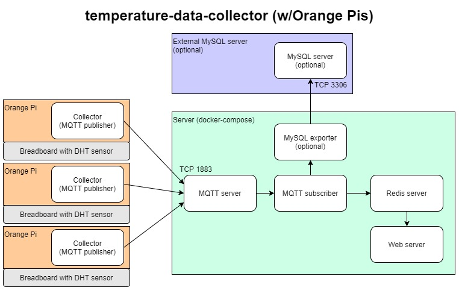
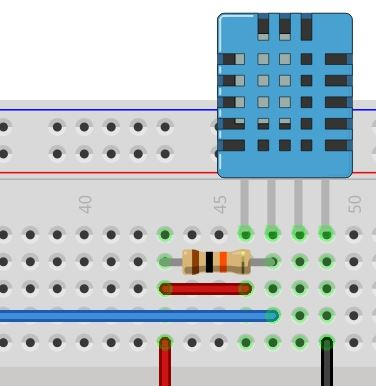

# temperature-data-collector
An application intended for a custom-built IoT device to collect, process, and display temperature and humidity data from a digital temperature and humidity sensor (DHT)

This is an all-in-one project including collectors for various hardware platforms, an MQTT system (server, subscribers, publishers), Redis server, the ability to write to MySQL, and a web server to monitor live data.

Components to be included (eventually all will be Dockerized):

### Collector:

- Pi sensor collector (completed, but not Dockerized yet)

OR

- Arduino sensor collector (not written yet)

### Server:

- MQTT server

- MQTT subscriber

- Redis server

- Node.js web server

- (Optional, not included) MySQL server

## Hardware

### Board

- Orange Pi (Zero)

OR

- [Arduino MKR1000](https://store-usa.arduino.cc/collections/boards/products/arduino-mkr1000-wifi-with-headers-mounted)

### Sensor

- [DHT11 sensor](https://www.amazon.com/Temperature-Humidity-Digital-3-3V-5V-Raspberry/dp/B07WT2HJ4F/ref=sr_1_1?keywords=dht11+sensor&qid=1638560461&sr=8-1)

OR

- [DHT22 sensor](https://www.adafruit.com/product/385)

	- Recommended. DHT22s are much more accurate, for only a tiny bit more.

### Miscellaneous

- Breadboard

- Jumper wires

- 10k ohm resistor (pull-up)

### Circuit diagram

[Image source](https://osoyoo.com/2017/07/19/arduino-lesson-dht11-sensor/)

## Process:

There are two components: Collector, and Server.

Collector code is in the `collector` directory. This can only run standalone for now, Docker support hopefully coming soon.

Server is everything else (web, redis, etc) and can be run via docker-compose (or each component standalone).

Collectors send data via MQTT to the server. The MQTT subscriber then adds to redis and stores to the permanent database. The web server will read from redis.

Focusing on development for the Orange Pi Zero first, due to hardware availability.

## Getting Started

This system is still in development. Some things may not work.

The server must be runing first, or the collector won't be able to make a connection to the MQTT server.

Server:

1. Clone and enter this repository on your server

2. Ensure port 1883 is open on your server, for the collector to send data over. Port 8080 is optional for reaching the web server externally.

3. Run `docker-compose up --build`

4. Server is ready to accept new connections from collectors

Collector:

1. Build the circuit in the "Circuit diagram" section above, with a 10k ohm resistor, DHT sensor, and Orange Pi. Have the data pin going to the proper GPIO port (the collector defaults to PA6)

2. On the Orange Pi, clone this repository and run collector/collector.py. Edit the script if you would like to change the sensor model, GPIO port, sample rate, etc.

3. You should get temperature and humidity values as output, and the data will be published via MQTT for the listening server.

## TODO (development):

For V1:

- Server: finish setup script

- Server: finish .env and docker-compose

- Collector: unit tests for Python collector

- MySQL export functionality in MQTT subscriber

- Why MQTT? Why not collector -> Redis, or MQTT -> web

For V2:

- Clean up and add Arduino code

- deploy Arduino code from setup script? Board setup via wifi?

- Dockerize collector
